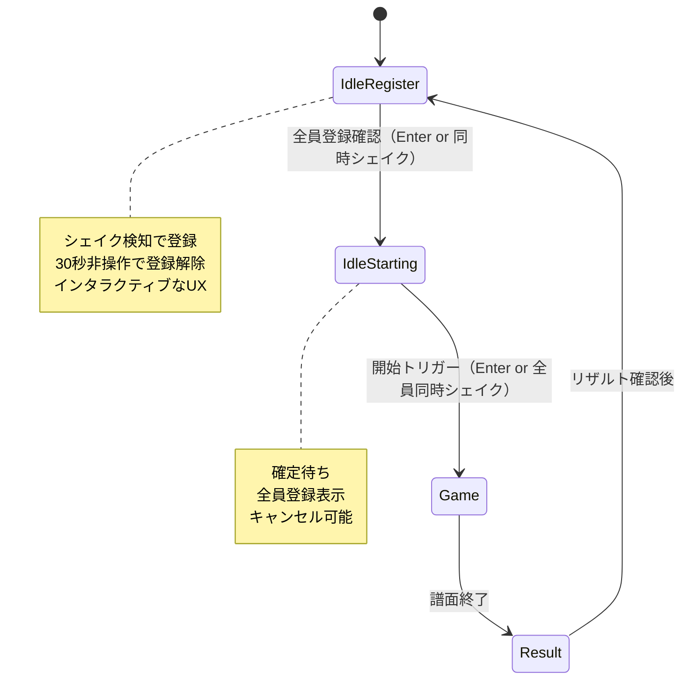
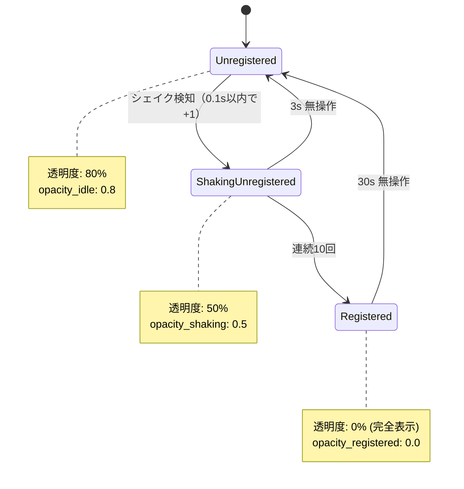
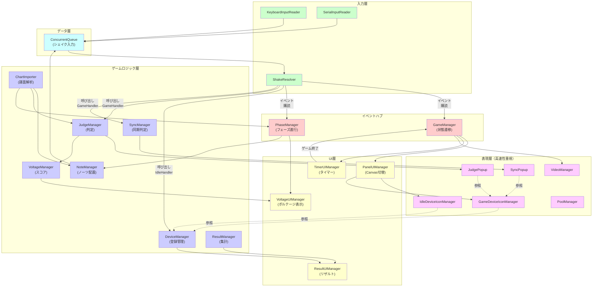

# Version2 ゲームシステム設計

## クイックスタート

### 設計の3つの大原則

| 原則 | 説明 | 実装上の注意 |
|------|------|----------|
| **イベント駆動** | 状態変更は必ずイベント発行 | UI/ロジック層の結合度低減 |
| **戦略パターン** | 状態ごとに入力処理を切替 | ShakeResolver が統一的に制御 |
| **遅延購読** | Awake順の依存性を排除 | EnsureSubscriptions() コルーチン |

### 主要な流れ（40行で理解できる概要）

```
【入力フェーズ】
シェイク → KeyboardInputReader/SerialInputReader → ConcurrentQueue

【ルーティング】
Queue → ShakeResolver.Update() → 現在の GameState に応じた Handler 選択

【状態別処理】
 ├─ IdleRegister → IdleRegisterHandler.HandleShake()
 │   └─ DeviceManager.ProcessRegistration()
 ├─ Game/セクション（Aメロ/Bメロ/サビ等） → SectionHandler.HandleShake()
 │   └─ 共通処理: JudgeManager.Judge() → イベント発行
 │   └─ （セクション固有処理は後で実装）
 └─ Result → 処理なし（集計済み）

【イベント発行】
DeviceManager / JudgeManager → OnDeviceRegistered / OnJudgeFired
   ↓
UI層が購読して画面更新
   ↓
PoolManager が表現層オブジェクト管理（Popup/Icon再利用）
```

## 目次
1. [デザインの大原則](#principles)
2. [ゲーム状態フロー](#game-flow)
3. [UX設計](#ux-design)
4. [データフロー図](#dataflow)
5. [システムアーキテクチャ](#architecture)
6. [依存関係グラフ](#dependency-graph)
7. [実装ロードマップ](#roadmap)
8. [詳細仕様](#specifications)
9. [Spec-Kit 仕様駆動開発](#spec-kit-workflow)

---

## デザインの大原則 {#principles}

### 1. イベント駆動アーキテクチャ

**何か**が起きたら **イベント発行** → **購読者が反応**

```
❌ 悪い例（タイト結合）
UI.icon_opacity = device.registration_progress / 10;  // UI が直接 Model に依存

✅ 良い例（疎結合）
DeviceManager.OnRegistrationChanged += (deviceId, progress) => {
    UI.icon_opacity = progress / 10;
}
```

**利点**：
- UI と ロジック層の変更が独立
- テストが容易（モック可能）
- 拡張が簡単（新 UI 追加時に既存コード変更不要）

### 2. 戦略パターン（Strategy Pattern）

**ゲーム状態に応じて入力の扱いを変える**

```csharp
// ShakeResolver が状態を監視
GameManager.OnGameStart += () => currentHandler = new GamePlayHandler();
GameManager.OnIdleRegister += () => currentHandler = new IdleRegisterHandler();

// ハンドラーを統一的に呼び出し
void Update() {
    if (shakeQueue.TryDequeue(out var shake)) {
        currentHandler.HandleShake(shake);  // 状態別処理
    }
}
```

**利点**：
- 状態ごとの処理ロジックが明確に分離
- 新しい状態追加が容易
- 単体テストが簡単

### 3. 遅延購読パターン

**Awake 順序に依存しない初期化**

```csharp
// ❌ 悪い例（OnEnable で即座に購読 → GameManager未初期化でnull参照）
void OnEnable() {
    GameManager.OnGameStart += HandleGameStart;
}

// ✅ 良い例（コルーチンで再試行）
void Start() {
    StartCoroutine(EnsureSubscriptions());
}

IEnumerator EnsureSubscriptions() {
    while (GameManager.Instance == null) yield return null;
    GameManager.OnGameStart += HandleGameStart;
}
```

**利点**：
- オブジェクト初期化順序に依存しない
- 動的ロード対応
- 再試行ロジックが容易

---

---

## ゲーム状態フロー {#game-flow}

### 状態遷移図



### 状態説明

| 状態 | 説明 | 遷移条件 | アイコン状態 |
|------|------|--------|----------|
| **IdleRegister** | デバイス登録待機 | シェイク検知でID登録 | 登録度に応じて透明度変化 |
| **IdleStarting** | 全員登録確認待機 | Enter or 同時シェイク で開始 | 全員表示、非登録は非表示 |
| **Game** | ゲーム進行中 | 譜面完了で終了 | 画面下部に配置 |
| **Result** | リザルト表示 | 確認ボタンで次へ | 最終スコア表示 |

---

## UX設計 {#ux-design}

### IdleRegister画面（インタラクティブアート風）

**ビジュアルコンセプト**: ミュージカルジェスチャーによる登録

```
┌─────────────────────────────────────┐
│  みんなでシェイク！                    │ ← タイトル
│                                       │
│                                       │
│            ◯ ◯ ◯ ◯ ◯ ◯           │ ← デバイスアイコン(シェイクエフェクトが出る)
│            （透明度80% 未登録）       │
│                                       │
│                                       │
│    [シェイクしてデバイスを登録]        │ ← ガイドテキスト
└─────────────────────────────────────┘
```

**デバイス登録時のデバイスアイコン状態管理**



**各状態でのUI表示**

| 状態 | 透明度 |
|------|------|
| 未登録 | 80% |
| シェイク中 | 50% |
| 登録済み | 0% |
| 登録済み（タイムアウト中） | 徐々に80%へ |
- どの状態でもシェイク時はエフェクトがでる

---

## データフロー図 {#dataflow}

### 1秒間のデータフロー（時系列）

```
T=0.000s: シェイク入力
    ↓ (物理デバイス/キーボード)
├─→ KeyboardInputReader OR SerialInputReader
    ↓ (ConcurrentQueue へ追加)
└─→ queue.Enqueue(shake)

T=0.016s: ShakeResolver.Update() 実行
    ├─→ queue.TryDequeue(out shake)
    ├─→ 現在の GameState を確認
    └─→ 対応ハンドラーを選択(イメージ)注:実装はイベント時に差し替える手法
        │
        ├─→ State=IdleRegister → IdleRegisterHandler.HandleShake()
        │       └─→ DeviceManager.ProcessRegistration(deviceId, timestamp)
        │           ├─→ consecutiveShakeCount++
        │           ├─→ [10回達成] → registered=true
        │           └─→ OnDeviceRegistered.Invoke(deviceId)
        │               └─→ IdleDeviceIconManager が購読して表示更新
        │
        ├─→ State=Game/Section(Aメロ/Bメロ/サビ) → SectionHandler.HandleShake()
        │       └─→ JudgeManager.Judge(deviceId, shake.timestamp)
        │           ├─→ 判定種別決定（Perfect/Good/Bad/Miss）
        │           ├─→ VoltageManager.Add(points)
        │           ├─→ OnJudgeFired.Invoke(result)
        │           │   ├─→ JudgePopup.Show() で表示
        │           │   └─→ GameDeviceIconManager が視覚フィードバック
        │           └─→ ResultManager が集計
        │               （セクション固有処理: 後で拡張）
        │
        └─→ State=Result → 処理なし（集計完了）

T=0.050s: 画面描画
    ├─→ UI層オブジェクトが最新状態で描画
    ├─→ Popup/Icon は PoolManager から取得
    └─→ キャッシュ効果で高速描画
```

### イベント駆動の流れ（構造図）

```
┌───────────────────────────────┐
│ ゲームロジック層                  │
├───────────────────────────────┤
│ DeviceManager                 │
│   OnDeviceRegistered          │
│   OnDeviceUnregistered        │
│                               │
│ JudgeManager                  │
│   OnJudgeFired(result)        │
│                               │
│ VoltageManager                │
│   OnVoltageChanged(delta)     │
│                               │
│ SyncManager                   │
│   OnSyncFired(bonus)          │
└───────┬───────────────────────┘
        │
        │ イベント購読
        ↓
┌───────────────────────────────┐
│ UI層                            │
├───────────────────────────────┤
│ IdleDeviceIconManager         │
│   → アイコン表示/非表示         │
│                               │
│ VoltageUIManager              │
│   → ボルテージゲージ更新        │
│                               │
│ JudgePopup / SyncPopup        │
│   → 判定結果表示              │
│                               │
│ ResultUIManager               │
│   → リザルト画面表示           │
└───────────────────────────────┘
```

---

## システムアーキテクチャ {#architecture}

### 層構成

```
┌─────────────────────────────────────────────────────────┐
│ UI層（イベント駆動型）                                      │
├─────────────────────────────────────────────────────────┤
│ ・PanelUIManager    ・VoltageUIManager                   │
│ ・TimerUIManager    ・ResultUIManager                    │
└─────────────────────────────────────────────────────────┘
                            ↑
                    イベント購読
                            │
┌─────────────────────────────────────────────────────────┐
│ イベントハブ（中央集約）                                    │
├─────────────────────────────────────────────────────────┤
│ ・GameManager       ・PhaseManager                       │
│ (状態遷移)          (フェーズ進行)                        │
└─────────────────────────────────────────────────────────┘
        ↑                        ↑
        │ 呼び出し                │ イベント
        │                        │
┌──────────────────────┐  ┌──────────────────┐
│ 入力層                │  │ ゲームロジック層    │
├──────────────────────┤  ├──────────────────┤
│ ShakeResolver        │  │ VoltageManager   │
│ (Strategyパターン)    │  │ DeviceManager    │
│                      │  │ SyncManager      │
│ ・IdleHandler        │  │ JudgeManager     │
│ ・GameHandler        │  │ ResultManager    │
│ ・NotePhaseHandler   │  │ ChartImporter    │
│ ・RestPhaseHandler   │  │ NoteManager      │
└──────────────────────┘  └──────────────────┘
        ↑                        
        │ キュー読み出し
        │                        
┌──────────────────────────────────────────┐
│ 入力キュー（ConcurrentQueue）              │
├──────────────────────────────────────────┤
│ ・KeyboardInputReader                    │
│ ・SerialInputReader                      │
└──────────────────────────────────────────┘

┌──────────────────────────────────────────┐
│ 表現層（非イベント駆動 - 高速性重視）      │
├──────────────────────────────────────────┤
│ ・SyncPopup / JudgePopup                 │
│ ・IdleDeviceIconManager                  │
│ ・GameDeviceIconManager                  │
│ ・VideoManager                           │
│ ・PoolManager                            │
└──────────────────────────────────────────┘
```

---

## 依存関係グラフ {#dependency-graph}

### システム全体の依存グラフ



### 依存の種類

- **実線（→）**: 強い依存（メソッド呼び出し、イベント発行）
- **点線（-.->）**: 弱い依存（参照取得、情報照会のみ）

---

## 実装ロードマップ {#roadmap}

### 優先順位判定マトリックス

| 優先度 | システム | 依存数 | TDD難度 | 期限 | 理由 |
|--------|---------|--------|--------|------|------|
| **P1** | GameManager | 0 | 低 | Week1 | 全ての根幹、依存なし |
| **P1** | ChartImporter | 0 | 中 | Week1 | 譜面読込（独立）、後続多数に必要 |
| **P1** | DeviceManager | 0 | 中 | Week1 | 登録ロジック独立、IdleIcon の基盤 |
| **P1** | JudgeManager | 1 | 中 | Week1 | ChartImporter に依存のみ、ゲーム中核 |
| **P2** | PhaseManager | 2 | 中 | Week2 | GameManager, ChartImporter に依存 |
| **P2** | VoltageManager | 2 | 低 | Week2 | GameManager, PhaseManager → UI 連携 |
| **P2** | SyncManager | 1 | 中 | Week2 | ChartImporter に依存、RestPhase 時の判定 |
| **P3** | ShakeResolver | 4 | 高 | Week3 | 戦略パターン実装、複数 Handler 統合 |
| **P3** | SectionHandler | 3 | 中 | Week3 | 共通処理実装（セクション固有は後で） |
| **P3** | IdleDeviceIconManager | 2 | 高 | Week3 | DeviceManager, GameManager（状態監視） |
| **P3** | GameDeviceIconManager | 3 | 中 | Week3 | DeviceManager, GameManager, JudgeManager（フィードバック） |
| **P4** | UI層 (4系) | 3+ | 低 | Week4 | イベント購読のみ、ほぼ独立 |
| **P4** | PoolManager | 0 | 低 | Week4 | 最適化用、機能に不可欠ではない |
| **P4** | VideoManager | 1 | 低 | Week4 | GameManager に依存、再生のみ |

### 実装フェーズ計画

#### **フェーズ 1（Week 1）：基礎データモデル** - 3日

**ゴール**: 登録・判定・スコア算出の仕様を確定

```
Day 1:
  spec-kit generate --tests
  → GameManager, ChartImporter テスト生成
  → 本体実装 + テスト合格確認

Day 2:
  → DeviceManager, JudgeManager テスト生成・実装
  → 登録・判定ロジックの動作確認

Day 3:
  → テスト全パス確認
  → ドキュメント自動生成（spec-kit docs）
```

**成果物**:
- ✅ GameManager (状態管理)
- ✅ ChartImporter (譜面読込)
- ✅ DeviceManager (登録管理)
- ✅ JudgeManager (判定)
- ✅ テストコード 20+ 個

#### **フェーズ 2（Week 2）：ロジック層統合** - 3日

**ゴール**: 複数システムの連携を検証

```
Day 1:
  → PhaseManager, VoltageManager テスト生成・実装
  → GameManager との連携テスト

Day 2:
  → SyncManager 実装
  → 同期判定ロジック検証

Day 3:
  → 統合テスト（全ロジック層が正しく連携）
```

**成果物**:
- ✅ PhaseManager
- ✅ VoltageManager
- ✅ SyncManager
- ✅ 統合テストコード 10+ 個

#### **フェーズ 3（Week 3）：入力ルーティング & 表現層** - 4日

**ゴール**: 入力→処理→表示の全パイプラインが動作

```
Day 1:
  → ShakeResolver (複数 Handler) 実装
  → 戦略パターンテスト

Day 2:
  → IdleDeviceIconManager (状態機械) 実装
  → 登録度表示ロジック検証

Day 3:
  → GameDeviceIconManager 実装
  → ゲーム中アイコン配置確認

Day 4:
  → 統合テスト（入力→判定→表示まで）
```

**成果物**:
- ✅ ShakeResolver (戦略パターン)
- ✅ IdleDeviceIconManager (状態機械)
- ✅ GameDeviceIconManager
- ✅ 統合テスト 15+ 個

#### **フェーズ 4（Week 4）：UI & 最適化** - 3日

**ゴール**: ゲーム全体がUI経由で操作可能

```
Day 1:
  → PanelUIManager, VoltageUIManager, TimerUIManager 実装
  → Canvas 切替・イベント購読の検証

Day 2:
  → ResultUIManager, ResultManager 実装
  → リザルト表示確認

Day 3:
  → PoolManager 実装（最適化）
  → パフォーマンステスト実施
```

**成果物**:
- ✅ UI層全て (4系)
- ✅ ResultManager
- ✅ PoolManager
- ✅ パフォーマンス報告書

### チェックリスト

#### フェーズ 1 チェックリスト

- [ ] GameManager テスト生成 & 実装
- [ ] GameManager テスト 100% 合格
- [ ] ChartImporter テスト生成 & 実装
- [ ] ChartImporter JSON 読込確認
- [ ] DeviceManager テスト生成 & 実装
- [ ] 登録ロジック（10回で登録）確認
- [ ] JudgeManager テスト生成 & 実装
- [ ] 判定ロジック（±時間差）確認
- [ ] 全テスト合格
- [ ] ドキュメント自動生成

#### フェーズ 2 チェックリスト

- [ ] PhaseManager テスト生成 & 実装
- [ ] PhaseManager フェーズ遷移確認
- [ ] VoltageManager テスト生成 & 実装
- [ ] ボルテージ加算確認
- [ ] SyncManager テスト生成 & 実装
- [ ] 同期判定ロジック確認
- [ ] 統合テスト（3システム連携）
- [ ] 全テスト合格

#### フェーズ 3 チェックリスト

- [ ] ShakeResolver ハンドラー実装
- [ ] IdleRegisterHandler テスト
- [ ] SectionHandler テスト（共通処理）
- [ ] IdleDeviceIconManager 状態機械実装
- [ ] 登録度アニメーション確認
- [ ] GameDeviceIconManager 配置確認
- [ ] JudgeFeedback ビジュアル確認（スケール/色/エフェクト）
- [ ] 統合テスト（入力→判定→フィードバック）

#### フェーズ 4 チェックリスト

- [ ] PanelUIManager Canvas 切替確認
- [ ] VoltageUIManager ゲージ更新確認
- [ ] TimerUIManager カウントダウン確認
- [ ] ResultUIManager リザルト表示確認
- [ ] PoolManager 再利用確認
- [ ] パフォーマンス測定（FPS, メモリ）
- [ ] 全統合テスト
- [ ] 本番品質確認

---

## 詳細仕様 {#specifications}

### 1. GameManager（イベント配信・状態管理）

**責務**: ゲーム全体のライフサイクル管理

**依存**: なし

**公開イベント**:
```csharp
public static UnityEvent OnIdleRegisterStart;  // IdleRegister開始
public static UnityEvent OnIdleStartingStart;  // IdleStarting開始
public static UnityEvent OnGameStart;          // Game開始
public static UnityEvent OnGameEnd;            // Game終了
public static UnityEvent OnResultStart;        // Result開始
```

**公開メソッド**:
```csharp
public static void TransitionToIdleRegister();
public static void TransitionToIdleStarting();
public static void StartGame();
public static void EndGame();
public static void ShowResult();
public static bool IsInState(GameState state);
```

---

### 2. ChartImporter（譜面データ解析）

**責務**: JSON譜面ファイルの読み込みと C# データ形式への変換

**依存**: なし（完全独立）

**公開メソッド**:
```csharp
public static ChartData LoadChart(string jsonPath);
public static NoteData[] GetNotesInPhase(int phaseIndex);
public static double GetPhaseStartTime(int phaseIndex);
public static Phase GetPhaseTypeAt(double time);
```

**データ構造**:
```csharp
public class ChartData {
    public List<PhaseData> phases;
    public double totalDuration;
}

public class PhaseData {
    public Phase phaseType;       // NotePhase, RestPhase, etc.
    public double startTime;
    public double duration;
    public NoteData[] notes;
}

public class NoteData {
    public double timestamp;      // (秒) 判定時間
    public int targetDeviceId;    // 対象デバイス（-1=全員）
    public NoteDifficulty difficulty;
}
```

---

### 3. PhaseManager（フェーズ進行管理）

**責務**: 譜面フェーズの進行管理とフェーズイベント発行

**依存**: `ChartImporter`, `GameManager`（呼び出しのみ）

**イベント**:
```csharp
public static UnityEvent<PhaseChangeData> OnPhaseChanged;
public static UnityEvent OnGameEnded;
```

**ロジック**:
- Game開始時に ChartImporter からフェーズデータを取得
- AudioSettings.dspTime と照合してフェーズ遷移を判定
- フェーズ変更時に OnPhaseChanged を発行

---

### 4. ShakeResolver（入力処理ルーター）

**責務**: キューの読み出しと Strategist ハンドラーへの委譲

**依存**: `GameManager`, `PhaseManager`（イベント購読）

**Strategy インターフェース**:
```csharp
public interface IShakeHandler {
    void HandleShake(string deviceId, double timestamp);
}
```

**コンクリートハンドラー**:

- **IdleRegisterHandler**: 
  - 処理: `DeviceManager.ProcessRegistration()`
  - イベント: `OnDeviceRegistered` 発行

- **SectionHandler** (共通実装)
  - 処理: `JudgeManager.Judge()` → `VoltageManager.Add()`
  - イベント: `OnJudgeFired` 発行
  - 拡張ポイント: セクション固有処理は後で `OnSectionSpecificLogic` として追加

---

### 5. DeviceIcon 管理システム（表現層）

複数のマネージャーが **ゲーム状態別に管理** する

#### 5a. IdleDeviceIconManager（Idle時のアイコン管理）

**責務**: IdleRegister 状態でのデバイスアイコン表示・状態管理

**依存**: `GameManager`（状態監視）、`DeviceManager`（登録状態参照）

**ロジック**:

```
デバイス状態遷移:

未登録 (Unregistered)
├─ 透明度: 80%
├─ シェイク → ShakingUnregistered
└─ 30秒無操作 → (維持)

シェイク中 (ShakingUnregistered)
├─ 透明度: 50%
├─ 連続10回 → Registered
└─ 0.3s無操作 → Unregistered

登録済み (Registered)
├─ 透明度: 0% (完全表示)
├─ 30s無操作 → Unregistering (進捗表示)
└─ エフェクト: 登録完了アニメ

登録解除中 (Unregistering)
├─ 透明度: 80% へ徐々に変化
├─ 30s経過 → Unregistered
└─ シェイク → ShakingUnregistered (リセット)
```

**保持データ**:
```csharp
private class DeviceIconState {
    public string deviceId;
    public RegistrationState state;
    public int consecutiveShakeCount;    // 0.1s以内でカウント
    public double lastShakeTime;
    public double stateChangeTime;       // 状態変更時刻
    public float currentOpacity;
}
```

**公開インターフェース**:
```csharp
public void ProcessShake(string deviceId, double timestamp);
public RegistrationState GetState(string deviceId);
public int GetRegisteredCount();
```

#### 5b. GameDeviceIconManager（Game時のアイコン管理）

**責務**: Game 状態でのデバイスアイコン配置・表示・ビジュアルフィードバック

**依存**: `GameManager`（状態監視）、`DeviceManager`（登録済みID取得）、`JudgeManager`（判定結果参照）

**機能**:
- Game開始時に登録済みデバイスのアイコンを画面下部に等間隔配置
- デバイスID → アイコン参照の提供（JudgePopup/SyncPopup用）
- 判定結果に応じたビジュアルフィードバック（スケール変更、色変更等）
- Pooling対応

**公開インターフェース**:
```csharp
public Transform GetIconTransform(string deviceId);
public Vector3 GetIconPosition(string deviceId);
public void RegenerateLayout();
public void PlayJudgeFeedback(string deviceId, JudgeResult result);
```

#### DeviceIcon 管理の状態別切替

```
ゲーム状態遷移に応じた管理の切替

┌──────────────────────────────────────────────────────────┐
│ IdleRegister State                                       │
├──────────────────────────────────────────────────────────┤
│ IdleDeviceIconManager がアクティブ                        │
│ ・アイコン: 独立した配置                                    │
│ ・機能: 登録度表示（透明度変化）                              │
│ ・ビジュアル: エフェクト（登録アニメ）                        │
│ ・購読: DeviceManager.OnDeviceRegistered                 │
└──────────────────────────────────────────────────────────┘
         ↓ GameManager.OnGameStart
┌──────────────────────────────────────────────────────────┐
│ Game State (Section)                                     │
├──────────────────────────────────────────────────────────┤
│ GameDeviceIconManager がアクティブ                        │
│ ・アイコン: 画面下部に等間隔配置                              │
│ ・機能: 判定フィードバック表示                                │
│ ・ビジュアル: スケール/色/エフェクト                          │
│ ・購読: JudgeManager.OnJudgeFired                        │
└──────────────────────────────────────────────────────────┘
         ↓ GameManager.OnGameEnd
┌──────────────────────────────────────────────────────────┐
│ Result State                                             │
├──────────────────────────────────────────────────────────┤
│ 両マネージャー非アクティブ                                  │
│ ・ResultUIManager が最終スコア表示                        │
└──────────────────────────────────────────────────────────┘
```

#### 実装の責任分離

| 項目 | IdleDeviceIconManager | GameDeviceIconManager |
|------|-----|-----|
| **活動期間** | IdleRegister のみ | Game 中のみ |
| **アイコン配置** | 自由配置 | 画面下部等間隔 |
| **ビジュアル** | 登録度（透明度） | 判定結果（スケール/色） |
| **イベント源** | DeviceManager | JudgeManager |
| **状態管理** | RegistrationState | JudgeResult キャッシュ |
| **初期化** | Game開始時非表示 | Game開始時生成 |
| **終了** | ゲーム終了時クリア | ゲーム終了時PoolManager へ返却 |

---

### 7. VoltageManager（スコア管理）

**責務**: ボルテージ（スコアに相当）の管理・計算

**依存**: `GameManager`, `PhaseManager`（イベント購読でルール切替）

**ロジック**:
- フェーズごとに異なる計算式を適用
- NotePhase: 判定結果 (Perfect/Good/Bad) に応じて ±ボルテージ
- RestPhase: シンクロボーナス
- 最終スコアは ResultManager に渡す

---

### 8. DeviceManager（登録状態管理）

**責務**: デバイスの登録状態・参加情報管理

**依存**: なし

**保持情報**:
```csharp
private class DeviceInfo {
    public string deviceId;
    public bool registered;             // Game参加可否
    public int registrationProgress;    // 0-10
    public double lastShakeTime;
}
```

**公開インターフェース**:
```csharp
public void ProcessRegistration(string deviceId, double timestamp);
public bool IsRegistered(string deviceId);
public IEnumerable<string> GetRegisteredDevices();
public int GetRegisteredCount();
public void ResetAll();  // IdleRegister開始時
```

---

### 9. SyncManager（同期判定）

**責務**: 複数デバイスの同期判定

**依存**: `ChartImporter`（判定窓確認用）

**ロジック**:
```
各デバイスの最新シェイク時間を記録
→ 「現在時刻 - 各デバイスの最新シェイク時間」が全て 0.2s以内
→ シンクロ判定
→ 判定後、内部の最新シェイク時間をリセット（持続防止）
```

**公開インターフェース**:
```csharp
public void RecordShake(string deviceId, double timestamp);
public bool CheckSync(double syncWindow = 0.2);  // 戻り値: シンク成功
public void Reset();
```

---

### 10. JudgeManager（判定）

**責務**: シェイク時刻とノーツ時刻の時間差から判定

**依存**: `ChartImporter`（判定窓確認）

**判定ロジック**:
```csharp
enum JudgeResult { Perfect, Good, Bad, Miss }

JudgeResult Judge(double shakeTime, double noteTime) {
    double diff = Mathf.Abs(shakeTime - noteTime);
    if (diff <= 0.05) return JudgeResult.Perfect;
    if (diff <= 0.10) return JudgeResult.Good;
    if (diff <= 0.15) return JudgeResult.Bad;
    return JudgeResult.Miss;
}
```

---

### 11. ResultManager（リザルト集計）

**責務**: ゲーム結果の集計・ランク判定

**依存**: `DeviceManager`（参加者確認）、`VoltageManager`（最終スコア）

**計算内容**:
- 総ボルテージ
- 判定別カウント（Perfect/Good/Bad/Miss）
- デバイス別スコア
- ランク判定

**ランク判定案**:
| スコア範囲 | ランク |
|----------|-------|
| 90-100 | S |
| 75-89 | A |
| 60-74 | B |
| 40-59 | C |
| 0-39 | D |

---

### 12. VideoManager（動画再生）

**責務**: Game 開始時から動画再生開始

**依存**: `GameManager`（OnGameStart 購読）

**ロジック**:
- Game開始時に VideoPlayer.Play()
- AudioSettings.dspTime と同期して再生
- 終了時に停止

---

### 13. UI マネージャー群（イベント駆動型）

#### PanelUIManager
- **責務**: Idle/Game/Result Canvas の表示切替
- **依存**: `GameManager`
- **ロジック**: OnIdleRegisterStart/OnGameStart/OnResultStart を購読

#### VoltageUIManager
- **責務**: ボルテージゲージ表示更新
- **依存**: `VoltageManager`
- **ロジック**: VoltageManager.OnVoltageChanged 購読

#### TimerUIManager
- **責務**: タイマー表示、時間切れ判定
- **依存**: `GameManager`（呼び出し）
- **ロジック**: 
  - PhaseManager.OnPhaseChanged で持続時間を取得
  - Update() でカウントダウン
  - 0秒で GameManager.EndGame()

#### ResultUIManager
- **責務**: リザルト画面表示
- **依存**: `ResultManager`
- **ロジック**: ResultManager の結果を表示

---

### 14. 表現層（高速性重視・非イベント駆動）

#### SyncPopup / JudgePopup
- **責務**: シンクロ/判定ポップアップ表示
- **依存**: `GameDeviceIconManager`（アイコン位置参照）
- **呼び出し元**: ShakeHandler (直接呼び出し)
- **最適化**: Pooling 対応

#### IdleDeviceIconManager
- **ロジック**: 上記詳細参照

#### PoolManager
- **責務**: DeviceIcon, NoteUI, Popup の再利用管理
- **オブジェクト**: 初期化時にプール生成、不足時に動的拡張

---

#### PoolManager
- **責務**: DeviceIcon, NoteUI, Popup の再利用管理
- **オブジェクト**: 初期化時にプール生成、不足時に動的拡張

---

## Spec-Kit 仕様駆動開発 {#spec-kit-workflow}

### Spec-Kit とは？

**Spec-Kit** は、仕様ファイル（`.spec` または `.spec.yml`）から自動的に**テストコード**や**実装スケルトン**を生成するツール。

**主な利点**:
- **仕様即テスト**: 要件を記述 = テストケース定義
- **テスト駆動開発（TDD）**: Red → Green → Refactor のサイクル
- **ドキュメント自動生成**: 仕様 = 最新のドキュメント
- **実装漏れ防止**: 仕様で定義した動作は必ずテストされる

### セットアップ

#### 1. Spec-Kit インストール

```bash
# npm/yarn でグローバルインストール
npm install -g @spec-kit/core

# または、プロジェクトローカル
npm install --save-dev @spec-kit/core
```

#### 2. 設定ファイル作成

**`spec-kit.config.js`** in project root:

```javascript
module.exports = {
  // 仕様ファイルの検索パターン
  specPattern: "documents/specs/**/*.spec.yml",
  
  // テストコード出力先
  testOutputDir: "Assets/Tests/GeneratedTests",
  
  // 実装スケルトン出力先
  implOutputDir: "Assets/Scripts/Generated",
  
  // プログラミング言語（C# for Unity）
  language: "csharp",
  
  // テストフレームワーク（NUnit for Unity）
  testFramework: "nunit",
};
```

#### 3. 仕様ファイル作成

**`documents/specs/device-manager.spec.yml`**:

```yaml
spec:
  name: DeviceManager
  description: "デバイス登録・状態管理システム"
  
  dependencies:
    - name: ChartImporter
      type: external
  
  scenarios:
    - name: "新規デバイスの登録"
      given: "デバイス1がシェイク入力を送信"
      when: "ProcessRegistration('1', timestamp) を呼び出し"
      then: 
        - "deviceInfo['1'].consecutiveShakeCount == 1"
        - "deviceInfo['1'].registered == false"
    
    - name: "連続10回シェイクで登録完了"
      given: "デバイス1が0.1秒間隔で10回シェイク"
      when: "最後のシェイクが処理される"
      then:
        - "deviceInfo['1'].registered == true"
        - "OnDeviceRegistered event fires with '1'"
    
    - name: "30秒無操作で登録解除"
      given: "デバイス1が登録済み状態"
      when: "最後のシェイクから30秒経過"
      then:
        - "deviceInfo['1'].registered == false"
    
    - name: "0.3秒以上の間隔でシェイクカウントリセット"
      given: "デバイス1がシェイク→0.3s待機→シェイク"
      when: "2番目のシェイクが処理される"
      then:
        - "deviceInfo['1'].consecutiveShakeCount == 1"
  
  properties:
    - name: shakesNeededToRegister
      type: int
      value: 10
      description: "登録に必要な連続シェイク回数"
    
    - name: registrationTimeoutSeconds
      type: double
      value: 30.0
      description: "登録解除までの待機時間"
    
    - name: shakeIntervalWindow
      type: double
      value: 0.1
      description: "連続シェイクと認識する最大間隔"
```

### Spec-Kit 開発フロー

#### Step 1: 仕様ファイル作成

```bash
# 各システムの仕様を .spec.yml で記述
documents/specs/
├── device-manager.spec.yml
├── voltage-manager.spec.yml
├── idle-device-icon-manager.spec.yml
├── judge-manager.spec.yml
└── sync-manager.spec.yml
```

#### Step 2: テスト自動生成

```bash
# Spec-Kit がテストコードを自動生成
spec-kit generate

# 出力例: Assets/Tests/GeneratedTests/DeviceManagerTests.cs
```

生成されたテスト例:

```csharp
[TestFixture]
public class DeviceManagerTests
{
    private DeviceManager deviceManager;
    
    [SetUp]
    public void Setup()
    {
        deviceManager = new DeviceManager();
    }
    
    [Test]
    [Description("新規デバイスの登録")]
    public void TestNewDeviceRegistration()
    {
        // Given: デバイス1がシェイク入力を送信
        string deviceId = "1";
        double timestamp = AudioSettings.dspTime;
        
        // When: ProcessRegistration を呼び出し
        deviceManager.ProcessRegistration(deviceId, timestamp);
        
        // Then: 検証
        Assert.AreEqual(1, deviceManager.GetDevice(deviceId).consecutiveShakeCount);
        Assert.IsFalse(deviceManager.GetDevice(deviceId).registered);
    }
    
    [Test]
    [Description("連続10回シェイクで登録完了")]
    public void TestRegistrationAfterTenShakes()
    {
        // Arrange: デバイスを10回シェイク
        string deviceId = "1";
        for (int i = 0; i < 10; i++)
        {
            deviceManager.ProcessRegistration(deviceId, AudioSettings.dspTime + (i * 0.05));
        }
        
        // Assert
        Assert.IsTrue(deviceManager.GetDevice(deviceId).registered);
        // OnDeviceRegistered イベントが発火したことを検証
    }
    
    // ... 他のテストケース
}
```

#### Step 3: テスト実行（Red フェーズ）

```bash
# Unity Test Runner で実行
# または CLI で実行
dotnet test Assets/Tests/GeneratedTests/

# 初期状態では全てFailする（仕様が未実装）
# ❌ FAILED: TestNewDeviceRegistration
# ❌ FAILED: TestRegistrationAfterTenShakes
# ...
```

#### Step 4: 実装スケルトン生成

```bash
# Spec-Kit が実装スケルトンを生成
spec-kit generate --impl

# 出力例: Assets/Scripts/Generated/DeviceManager.cs
```

生成スケルトン:

```csharp
public class DeviceManager : MonoBehaviour
{
    public static DeviceManager Instance { get; private set; }
    
    public event Action<string> OnDeviceRegistered;
    
    [SerializeField] private int shakesNeededToRegister = 10;
    [SerializeField] private double registrationTimeoutSeconds = 30.0;
    [SerializeField] private double shakeIntervalWindow = 0.1;
    
    private Dictionary<string, DeviceInfo> devices = new Dictionary<string, DeviceInfo>();
    
    public void ProcessRegistration(string deviceId, double timestamp)
    {
        // TODO: 仕様を実装してください
        // - deviceInfo を更新
        // - 10回で registered = true
        // - OnDeviceRegistered を発火
        throw new NotImplementedException();
    }
    
    public DeviceInfo GetDevice(string deviceId)
    {
        // TODO: 実装
        throw new NotImplementedException();
    }
    
    // ... その他のメソッド
}
```

#### Step 5: 実装（Green フェーズ）

スケルトンをもとに実装を進める：

```csharp
public void ProcessRegistration(string deviceId, double timestamp)
{
    if (string.IsNullOrEmpty(deviceId)) return;

    if (!devices.TryGetValue(deviceId, out var info))
    {
        info = new DeviceInfo 
        { 
            deviceId = deviceId, 
            lastShakeTime = timestamp, 
            consecutiveShakeCount = 1, 
            registered = false 
        };
        devices[deviceId] = info;
        return;
    }

    // 0.1秒以内でカウント加算、以上でリセット
    if (timestamp - info.lastShakeTime <= shakeIntervalWindow)
    {
        info.consecutiveShakeCount++;
    }
    else
    {
        info.consecutiveShakeCount = 1;
    }
    
    info.lastShakeTime = timestamp;

    // 10回で登録完了
    if (!info.registered && info.consecutiveShakeCount >= shakesNeededToRegister)
    {
        info.registered = true;
        OnDeviceRegistered?.Invoke(deviceId);
    }
}
```

#### Step 6: テスト実行（Green フェーズ）

```bash
dotnet test Assets/Tests/GeneratedTests/

# ✅ PASSED: TestNewDeviceRegistration
# ✅ PASSED: TestRegistrationAfterTenShakes
# ✅ PASSED: TestRegistrationTimeoutAfterThirtySecs
# ... 全テストパス
```

#### Step 7: リファクタ

テストが通ったら、パフォーマンス最適化やコード品質改善を行う：

```csharp
// リファクタ例: Dictionary.TryGetValue の最適化
public void ProcessRegistration(string deviceId, double timestamp)
{
    // ... 同じ動作だがより効率的
}
```

再度テストを実行して回帰がないことを確認。

### 仕様ファイルテンプレート

**`documents/specs/template.spec.yml`**:

```yaml
spec:
  name: SystemName
  description: "システムの説明"
  
  dependencies:
    - name: DependencyName
      type: external | internal
  
  scenarios:
    - name: "シナリオ名（Given-When-Then形式）"
      given: "前提条件"
      when: "アクション"
      then:
        - "期待結果1"
        - "期待結果2"
  
  properties:
    - name: propertyName
      type: int | double | string | bool
      value: defaultValue
      description: "説明"
  
  edge_cases:
    - name: "エッジケース名"
      description: "境界値やエラー条件"
      given: "前提"
      when: "入力"
      then: "期待"
```

### Version2 向け仕様ファイル一覧

```
documents/specs/
├── 00-game-manager.spec.yml
├── 01-chart-importer.spec.yml
├── 02-phase-manager.spec.yml
├── 03-device-manager.spec.yml
├── 04-idle-device-icon-manager.spec.yml
├── 05-game-device-icon-manager.spec.yml
├── 06-voltage-manager.spec.yml
├── 07-sync-manager.spec.yml
├── 08-judge-manager.spec.yml
├── 09-result-manager.spec.yml
├── 10-video-manager.spec.yml
├── 11-shake-resolver.spec.yml
├── 12-note-manager.spec.yml
└── README.md  # 仕様リポジトリの使い方
```

### 実装順序（依存関係を踏まえた TDD）

1. **独立したシステム**（依存なし）
   - GameManager
   - ChartImporter
   - DeviceManager
   - JudgeManager

2. **基本依存**（1を必要とする）
   - PhaseManager（ChartImporter）
   - VoltageManager（GameManager, PhaseManager）
   - SyncManager

3. **複合依存**（2を必要とする）
   - ShakeResolver（ハンドラー）
   - IdleDeviceIconManager
   - GameDeviceIconManager

4. **UI層**（ほぼ最後）
   - PanelUIManager
   - VoltageUIManager
   - TimerUIManager
   - ResultUIManager

### Spec-Kit CLI コマンド

```bash
# 仕様から全てを生成
spec-kit generate --all

# テストのみ生成
spec-kit generate --tests

# 実装スケルトンのみ生成
spec-kit generate --impl

# 仕様ファイルのバリデーション
spec-kit validate documents/specs/

# ドキュメント生成（仕様 → HTML/Markdown）
spec-kit docs --output ./docs/generated/

# テストカバレッジレポート
spec-kit coverage

# 仕様とテストのギャップ検出
spec-kit diff --specs docs/specs/ --tests Assets/Tests/
```

### uv を使った Spec-Kit セットアップ

**UV との互換性**: ✅ 完全互換 - `uv` は npm パッケージマネージャー互換

#### Option 1: グローバルインストール（推奨）

```bash
# uv でグローバルインストール
uv pip install spec-kit

# または Node.js ツールの場合
uv tool install @spec-kit/core
```

#### Option 2: プロジェクトローカルインストール

**`pyproject.toml`**:
```toml
[project]
dependencies = [
    "@spec-kit/core>=1.0.0",
]
```

**実行**:
```bash
# プロジェクト依存をインストール
uv sync

# Spec-Kit 実行
uv run spec-kit generate --tests
```

#### Option 3: Node.js + uv の混合（推奨）

```bash
# Node.js がインストール済みの場合
uv tool run npm install -g @spec-kit/core

# Spec-Kit 実行
spec-kit generate --tests
```

**パフォーマンス**: `uv` は `npm` より **5-10倍高速** なため、迅速な開発が可能

### チームでの運用

#### ルール

1. **仕様ファイル先行**
   - コード実装前に仕様を `.spec.yml` で定義
   - PR レビューは仕様の正確性を確認

2. **テスト自動生成の活用**
   - 手書きテストは不要（Spec-Kit が生成）
   - カスタムテストのみ `*Custom.cs` に記述

3. **仕様ドキュメントの同期**
   - 実装変更時に仕様ファイルも更新
   - `spec-kit diff` で乖離を検出

4. **CI/CD 統合**（GitHub Actions 例）
   ```yaml
   # .github/workflows/test.yml
   name: TDD Pipeline
   
   on: [push, pull_request]
   
   jobs:
     test:
       runs-on: ubuntu-latest
       steps:
         - uses: actions/checkout@v3
         - uses: astral-sh/setup-uv@v1
         - run: uv tool run spec-kit generate --tests
         - run: dotnet test Assets/Tests/GeneratedTests/
   ```

### トラブルシューティング

| 問題 | 原因 | 解決 |
|------|------|------|
| `uv: コマンドが見つかりません` | uv 未インストール | `pip install uv` で インストール |
| テスト生成失敗 | 仕様ファイルのYAML構文エラー | `spec-kit validate documents/specs/` で確認 |
| 実装スケルトン不足 | 仕様に記述がない | `.spec.yml` に更に詳細記述 |
| テスト数が多すぎる | Given/When/Then が多い | シナリオを統合・簡潔化 |
| uv のパッケージ解決が遅い | キャッシュが無効 | `uv cache prune` で削除後再度実行 |

---

## まとめ

### Version2 開発の推奨プロセス

```
仕様定義（.spec.yml）
        ↓
テスト自動生成（uv run spec-kit generate --tests）
        ↓
テスト実行（❌ FAILED）← Red
        ↓
実装スケルトン生成（uv run spec-kit generate --impl）
        ↓
実装コーディング
        ↓
テスト実行（✅ PASSED）← Green
        ↓
リファクタ（品質向上）
        ↓
テスト実行（✅ PASSED）← Refactor
        ↓
ドキュメント自動生成（uv run spec-kit docs）
```

### 即座のアクション

1. **uv インストール**
   ```bash
   pip install uv
   ```

2. **Spec-Kit インストール**
   ```bash
   uv tool install @spec-kit/core
   # または
   uv pip install spec-kit
   ```

3. **設定ファイル作成**
   - `spec-kit.config.js` をプロジェクトルートに配置

4. **仕様ファイル作成開始**
   - `documents/specs/00-game-manager.spec.yml` から開始

5. **テスト自動生成**
   ```bash
   uv run spec-kit generate --tests
   ```

6. **TDD サイクル開始**
   - Red → Green → Refactor の繰り返し

---

## 参考資料

- [Spec-Kit Official Docs](https://spec-kit.dev/)
- [UV - 超高速 Python パッケージマネージャー](https://github.com/astral-sh/uv)
- [TDD (Test-Driven Development)](https://martinfowler.com/bliki/TestDrivenDevelopment.html)
- [YAML Specification](https://yaml.org/)
- [NUnit for Unity](https://docs.nunit.org/)

