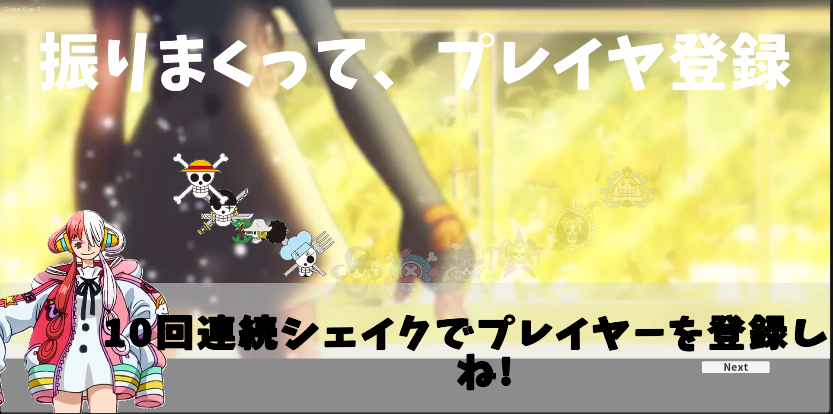
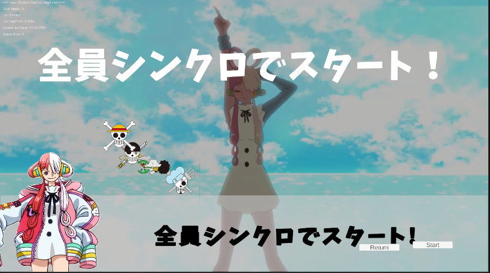
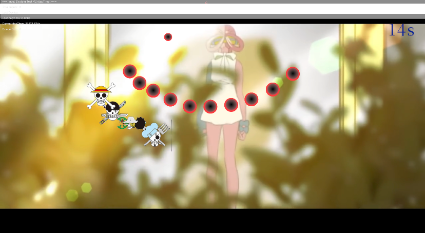

### ゲーム説明
- プレイヤーはシェイク棒を持ち、流れてくるやつ「ノート」に合わせてシェイクします。
- シェイクのタイミングが良いほど高得点が入ります。
- さらに、他のプレイヤーとシンクロしてシェイクすると、得点がアップします。

- 「ノート」がないところでシェイクすると、ペナルティとしてボルテージが減少します。
- 「ノート」が連続して流れてくるところは連打ポイントです。ここで全力でシェイクして高得点を狙いましょう。
- ゲーム終了時にボルテージに応じた評価が表示されます。
#### 進行
1. ゲーム開始前にデバイス登録フェーズがあります。シェイク棒を10回連続で振ってデバイスを登録してください。全員が登録出来たら、係員がエンターキーを押して次に進みます。
2. 全員でシェイクのタイミングを合わせるとゲームがスタートします。
3. ゲームフェーズです。流れてくるノートに合わせてシェイクしてください。
4. ゲーム終了後、結果発表フェーズになります。![alt text](image-1.