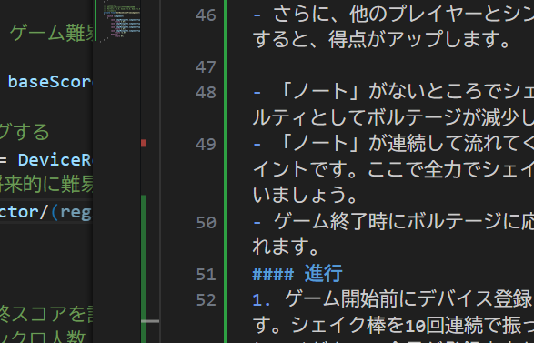

## 2025-12-02 01:11:54
- ゲーム状態遷移完成
次やること
- [x] GameManagerに状態変数実装
- [x] それを使って、ゲームプレイ状態の時には、ラグをデバッグログ(VideoManager)
- [x] ゲーム中でのシェイク処理(該当のアイコンがエフェクトを発する)アイコンは生成が面倒なので、全部配置しておく→インスペクタ参照
  - エフェクトのClearBehaviorをNoneにすることが大切だった。
- [x] シンクロ検知　(2人でもシンクロ、)
- [x] ジャッジポップアップ表示　ジャッジポップアップは子オブジェクトにして、エフェクトと同様に再生できるようにする。ジャッジメントするやつも整備する。
- [x] アニメーションがなかったっぽい　つくる。
- [ ] ジャッジメント関連整備、旧コード移植
- [ ] シェイク時効果音
- [x] スコア、ボルテージ表示　ボルテージはシェイク回数にシンクロ率で重みづけ。
- [x]デバイス登録フェーズの処理と、デバイス登録情報をほかでちゃんと使うようにする
- [ ]イベント購読とかがGameManagerV2未起動でできない場合とかの対処
- [x] IdleStartingの実装。
- [x] ノート流れてくるのの実装
- [x] いらないコードとかの整理
- [ ] エディタ設定とか、何で保存されないのか原因究明
- [x] 書き出したときに、IdleStartingでアイコンが出ないという問題の解決 → 原因はDeviceListContainerの中に入ってなかったこと
- [ ] DeviceRegisterManagerとかで、GamePhaseにいらない処理をしないようにする。

- [ ] ウタのメッセージを表示するようにする。
- [ ] プレイの説明書く
- [ ] アイコンと、ノートの画像を差し替える。

- [x] スコア計算の修正
- [ ] 判定窓の大きさを調整

- [ ] 音量の調整

- [ ] 効果音探す
- [ ] 譜面作る

### アイデア
- 画面上部のボルテージゲージが満タンになると、特別なボーナスが発動します。
- 例えば、一定時間ノートが2倍の速度で流れてくる「ハイテンションモード」や、全員のシンクロ率が大幅にアップする「シンクロブースト」などがあります。
- これらのボーナスは、ゲームの戦略性を高め、プレイヤー同士の協力を促進します。
- 結果発表時に、グラフ表示でわかりやすくする。
- 結果発表時に一人一人のジャッジメントの内訳を表示する。
- 結果発表時に、シンクロ率の高かったペアやグループを特別に表彰するセクションを設ける。
- 結果発表時にシンクロ度を表示する。
- ゲーム説明は、すべてウタのメッセージで行う。
### ゲーム説明たたき台
- プレイヤーはシェイク棒を持ち、流れてくるやつ「ノート」に合わせてシェイクします。
- シェイクのタイミングが良いほど高得点が入ります。
- さらに、他のプレイヤーとシンクロしてシェイクすると、得点がアップします。

- 「ノート」がないところでシェイクすると、ペナルティとしてボルテージが減少します。
- 「ノート」が連続して流れてくるところは連打ポイントです。ここで全力でシェイクして高得点を狙いましょう。
- ゲーム終了時にボルテージに応じた評価が表示されます。
#### 進行
1. ゲーム開始前にデバイス登録フェーズがあります。シェイク棒を10回連続で振ってデバイスを登録してください。全員が登録出来たら、係員がエンターキーを押して次に進みます。
2. 全員でシェイクのタイミングを合わせるとゲームがスタートします。
3. ゲームフェーズです。流れてくるノートに合わせてシェイクしてください。
4. ゲーム終了後、結果発表フェーズになります。
   